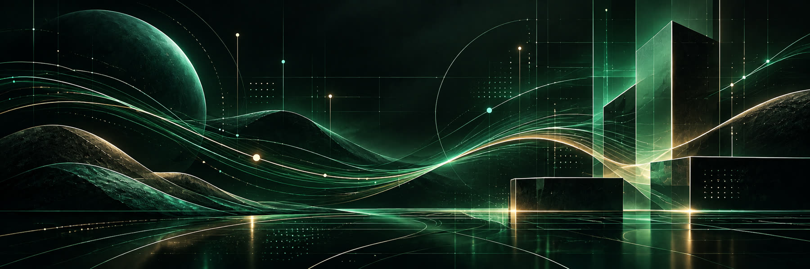

# Saaleh Ijaz

### Software Developer · Web Applications · Python Tools · Automation

I build practical software with a business-aware approach—clear interfaces, reliable workflows, and technology chosen for the problem rather than the trend.

[LinkedIn](https://www.linkedin.com/in/saaleh-ijaz-aipy/) · [Email](mailto:aipyfusion@gmail.com)

## Selected work

<table>
<tr>
<td width="50%" valign="top">

### [MarkIt](https://github.com/Sahil-Rajpoot-AiPy/markit)

A desktop application for applying consistent watermarks and branding across batches of images.

`Python` `CustomTkinter` `Pillow` `PyInstaller` `Pytest`

**Built around:** batch processing, visual preview, configurable placement and export, desktop packaging, and automated checks.

</td>
<td width="50%" valign="top">

### [Teacher's Bag](https://github.com/Sahil-Rajpoot-AiPy/Teacher-s-Bag)

A role-based training portal that separates the teacher learning experience from curriculum and user administration.

`React` `TypeScript` `Firebase Auth` `Firestore` `Tailwind CSS`

**Built around:** protected routes, role-based access, content management, progress tracking, responsive UI, and security rules.

**Public portfolio project** with representative screenshots, documented setup, and automated checks.

</td>
</tr>
</table>

## What I bring to a project

- **Product-minded development** — I start with the user, workflow, and business outcome.
- **Practical implementation** — web applications, Python utilities, automation, and improvements to existing digital products.
- **Cross-functional context** — experience across WordPress, digital marketing, e-commerce operations, and software QA.
- **Clear handoff** — readable documentation, reproducible setup, and honest boundaries around project status.

## Working toolkit

**Languages:** Python · JavaScript · TypeScript · SQL  
**Web:** React · HTML · CSS · WordPress  
**Application & data:** Firebase · Firestore · REST APIs · Desktop GUI development  
**Workflow:** Git · GitHub · Linux · Testing · Packaging

## Current direction

I’m deepening my backend and software-engineering practice by building complete, useful projects—especially tools for business workflows, education, e-commerce, retail, and automation.

---

**Useful software. Thoughtful interfaces. Measurable outcomes.**

